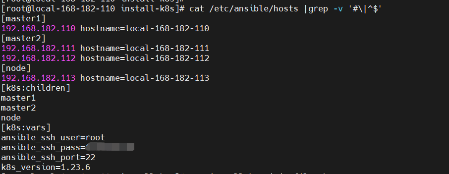
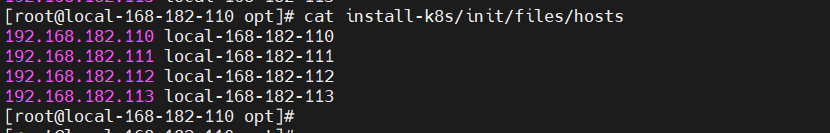
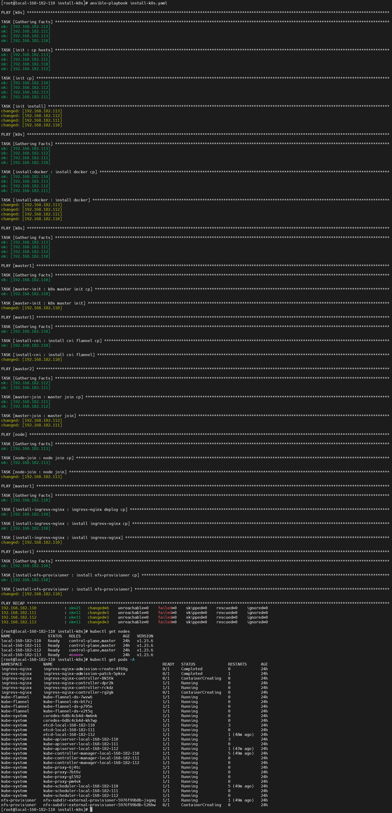
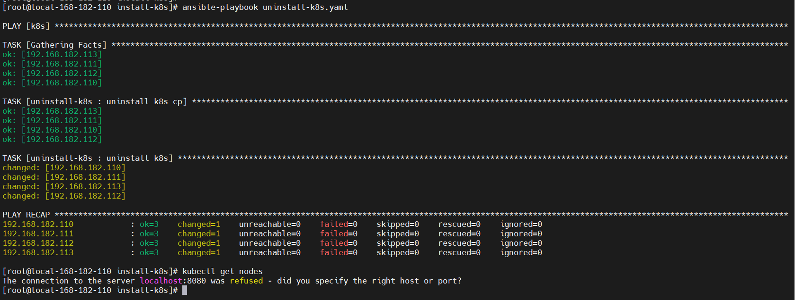

## k8s 一键部署
### 1）基于ansible 一键部署k8s流程图：


### 2）安装ansible

```
yum -y install epel-release
yum -y install ansible
ansible --version
```
开启记录日志：
配置文件：`/etc/ansible/ansible.cfg`
```bash
vi /etc/ansible/ansible.cfg  
# 去掉前面的'#'号
#log_path = /var/log/ansible.log ==> log_path = /var/log/ansible.log
```

去掉第一次连接ssh ask确认

```bash
vi /etc/ansible/ansible.cfg  
# 其实就是把#去掉
# host_key_checking = False  ==> host_key_checking = False
```

### 3）下载

```
git clone https://gitee.com/hadoop-bigdata/install-k8s.git
```

### 4）修改配置

修改节点信息，配置文件：`/etc/ansible/hosts`


修改`install-k8s/init/files/hosts`


### 5）执行部署
```bash
# 可以加上-vvv显示更多信息
ansible-playbook install-k8s.yaml
kubectl get nodes
kubectl get pods -A
```


### 6）卸载
```bash
ansible-playbook uninstall-k8s.yaml
```

